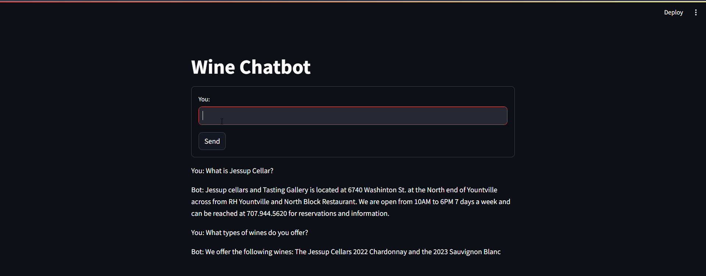

# Wine Chatbot: Intelligent Q&A System

This project involves creating an intelligent chatbot for a wine business that can answer customer queries based on a specific corpus of information about their products. The chatbot uses Elasticsearch for indexing and searching, SentenceTransformers for semantic understanding, and Streamlit for a user-friendly interface.

- Users can interact with the chatbot by asking questions about the wine products.
- The chatbot translates these questions into semantic search queries and retrieves relevant answers from the corpus.
- If the question is beyond the scope of the corpus, the chatbot directs users to contact the business directly.

For instance, a user might ask:
- "What are your best red wines?"
- "Can you tell me more about your wine tasting events?"

The chatbot intelligently interprets these questions, searches the corpus for relevant answers, and provides a response based on the indexed data.



## Project Highlights

- The wine-related information is indexed in Elasticsearch for efficient searching.
- The system uses semantic search with sentence embeddings to find relevant answers.
- The user interface is built using Streamlit for a minimalistic and interactive experience.
- The project handles context by maintaining conversation history.

## Installation

1. Clone this repository to your local machine using:

   ```bash
   git clone https://github.com/yourusername/wine-chatbot.git
   ```

2. Install the required dependencies using pip:

   ```bash
   pip install -r requirements.txt
   ```

3. Ensure Elasticsearch is installed and running on your local machine. For setup instructions, refer to the [Elasticsearch documentation](https://www.elastic.co/guide/en/elasticsearch/reference/current/install-elasticsearch.html).


## Usage

1. Preprocess and index your corpus into Elasticsearch using `index_corpus.py`. Make sure you have the corpus text and sample Q&A JSON files ready.

   ```bash
   python index_corpus.py
   ```

2. Run the Streamlit app by executing:

   ```bash
   streamlit run app.py
   ```

3. The web app will open in your browser where you can interact with the chatbot.

## Sample Questions

- "What are your best red wines?"
- "Tell me more about your wine tasting events."
- "Do you have any discounts available for your wines?"
- "What are the top-rated white wines in your collection?"

## Project Structure

- `app.py`: The main Streamlit application script.
- `index_corpus.py`: Script for preprocessing and indexing the corpus into Elasticsearch.
- `requirements.txt`: A list of required Python packages for the project.
- `Sample Question Answers.json`: JSON file containing sample question-answer pairs for predefined responses.
- `Corpus.pdf`: The PDF file containing the corpus of wine-related information.
- `Wine Chatbot PDF.pdf`: The PDF file containing the project related information.
- `chatbot_video.mp4`: The video demonstratin of the project.

## Troubleshooting

### Elasticsearch Connection Issues

- **Problem**: Connection errors with Elasticsearch.
- **Solution**: Ensure Elasticsearch is running and accessible at the specified host. Verify your connection settings in the `index_corpus.py` and `app.py` files.

### Module Errors

- **Problem**: Missing modules or import errors.
- **Solution**: Reinstall the required packages using `pip install -r requirements.txt` and verify compatibility with your Python version.

## Future Scope

### Enhanced Search Capabilities

- **Contextual Search**: Implement advanced NLP techniques to improve context-aware search.
- **Multi-language Support**: Extend the chatbot to support multiple languages for a wider audience.

### Feature Expansion

- **Voice Interaction**: Add speech recognition and synthesis for voice-based interactions.
- **Personalization**: Incorporate user profiles and preferences for personalized recommendations.
- **Integration with CRM**: Connect the chatbot with a CRM system to provide real-time updates on orders and customer information.

### Analytics and Feedback

- **User Feedback**: Implement mechanisms to gather and analyze user feedback for continuous improvement.
- **Analytics Dashboard**: Create a dashboard to monitor user interactions and assess chatbot performance.

### Deployment and Scaling

- **Cloud Deployment**: Deploy the chatbot to cloud services to ensure scalability and reliability.
- **Performance Optimization**: Optimize the chatbot for better performance and lower latency.

---

Feel free to customize any sections based on the specifics of your project or add additional details as needed.
